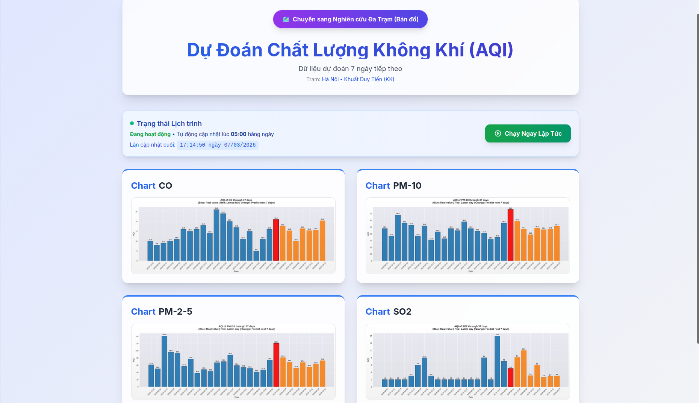
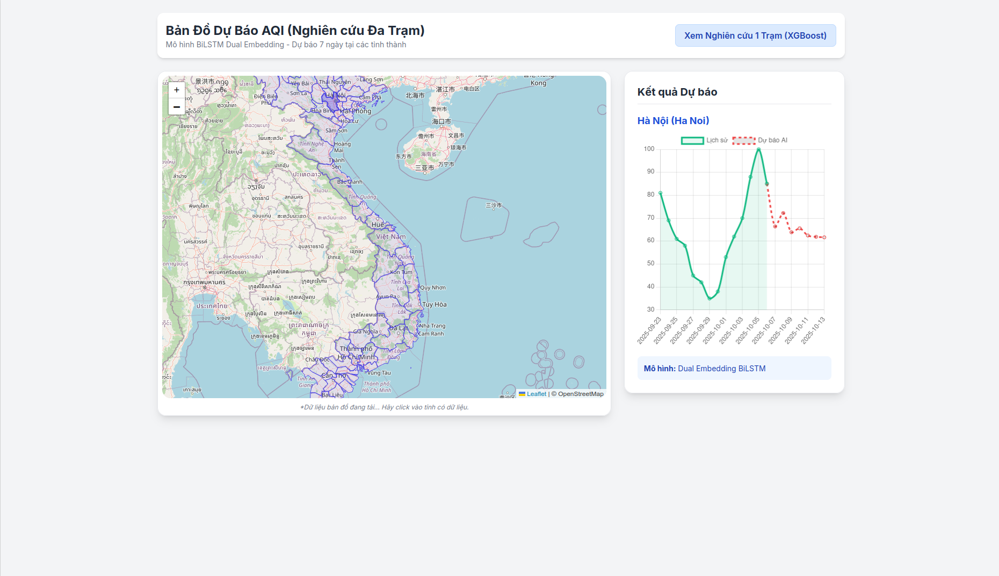

# Time Series Vietnam AQI Forecasting 

This repository contains a project in which we apply web‑crawling techniques to collect raw air‑quality data from the official government website. The collected data is then stored, cleaned, and preprocessed to prepare it for modeling. We employ two machine‑learning models—XGBoost and BiLSTM—to learn temporal patterns in the dataset and generate multi‑day air‑quality forecasts.

To present the model outputs, we developed a simple web application called “Vietnam AQI Forecasting.” The platform provides 7‑day forecasts for four key AQI components: CO, SO₂, PM2.5, and PM10—these are the primary pollutants contributing to degraded air quality.

When the web application is deployed, the full data pipeline runs once to fetch and update the latest measurements. The results are then rendered on the website, where users can switch between chart views or map views to explore pollutant concentrations or the overall AQI value at a selected monitoring station.

